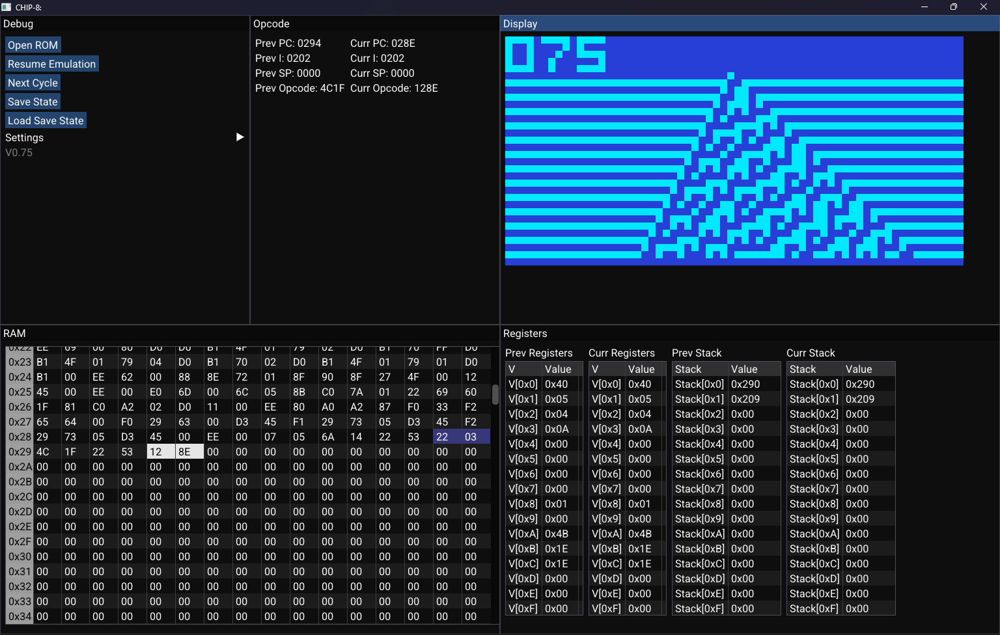

<h1>CHIP-8 Interpreter</h1>
 
  
A CHIP-8 interpreter / "emulator" written in C++

<h2>Usage:</h2>
CHIP8.exe  

<h2>HISTORY:</h2> 
<b>v0.76</b> - Added Reset ROM button  
- Added target frame rate slider  
- Fixed bug of not being able to load save state  
 
<b>v0.75</b> - Removed timer decrement from Chip8 cycle function and placed them in main, always running at ~60Hz. This is the correct implementation; some games do use the timers to run their games at a consistent FPS regardless of number of cycles run.  
- Added checks for OOB accesses in function table decoders.  
- Removed CycleDelay from Chip8 and replaced it with cyclesPerFrame in Chip8Platform; changed main to correspond. Emulation now can run set number of cycles per frame, instead of running max one cycle per frame.  
- Replaced default ImGui font with Roboto.  
 
<b>v0.74</b> - Removed command line args; you now run the .exe and set up everything in program  
- Added Open ROM button to UI, uses NativeFileDialog-Extended library to open file dialog for picking ROM to run  
- Added Settings button to UI with following options:  
    - Cycle Delay: 0 to 128  
    - Shift Vy  
    - Jump W/ Offset  
    - Display sizes: 1x to 16x  
    - On & off colors  
- Added vec4ToRGBA function for color conversion  
- Minor changes to layout and initialization  
 
<b>v0.73</b> - Removed vendored folder and SDL and ImGui submodules; CMake build now takes care of fetching the content  
- Included NativeFileDialog-Extended, setting up for being able to open ROM files while running program  
 
<b>v0.72</b> - Removed roms folder for cleaner repo and licensing  
- Removed VSync from renderUI, as it was slowing emulation down to screen refresh rate  
- Added simple load and save state  
- Minor UI layout changes  
 
<b>v0.71</b> - Added some basic window scaling layout  
 
<b>v0.7</b> - Added more information to debug UI (previous & current SP, stack)  
- Added some text labels to UI  
 
<b>v0.6</b> - Included ImGui into project. Using the SDL3Renderer backend for ease  
- Added initial parts of ImGui debugging window  
- Added fields for previous cycle's values for things like the stack, memory, and registers to Chip8, also for debugging  
- Added .gitmodules for ease of grabbing SDL and ImGui  
 
<b>v0.5</b> - Big jump from v0.01, but justified as the interpreter is now fully working! (I believe. I haven't had any tests or games break it so far)  - Created Chip8Platform class, taking inspiration from https://austinmorlan.com/posts/chip8_emulator/   - Added some Doxygen comments  - Added color configuration  - Changed configuration to run off of input arguments   - Added very basic pause and step through functionality  - Included 2 more ROMs, 1D cellular automata and breakout  - Renamed the Tetris file since for some reason the previous name crashed the program on startup. Certainly something with the displayTitle concat to fix 
 
The next goal for v1.0 is to do step 2, create a debug window that displays the current opcode, registers and values, stack, and memory with ImGUI. 
 
<b>v0.01</b> - First commit! Doing this now because the interpreter is close to fully working in C, but I can't determine why
keypresses are not triggering the right behavior. I need a better way of debugging and to do that, I'm going to:  

1. Convert to C++ and encapsulate everything CHIP8 related in its own class for easier use  
2. Create a debugging interface with ImGUI

<h2>Acknowledgements:</h2>
<ul>
<li>NativeFileDialog-Extended library: https://github.com/btzy/nativefiledialog-extended
<li>Wonderful high-level overview of how to create a CHIP-8 interpreter: https://tobiasvl.github.io/blog/write-a-chip-8-emulator/#logical-and-arithmetic-instructions </li>
<li>Test suite of ROMs: https://github.com/Timendus/chip8-test-suite </li>
<li>Another CHIP-8 impl. in C++ used as reference, mainly for the function pointer table setup (wanted to test idea out for use in future GB emulator) and SDL Platform: https://austinmorlan.com/posts/chip8_emulator/ </li>
</ul>
